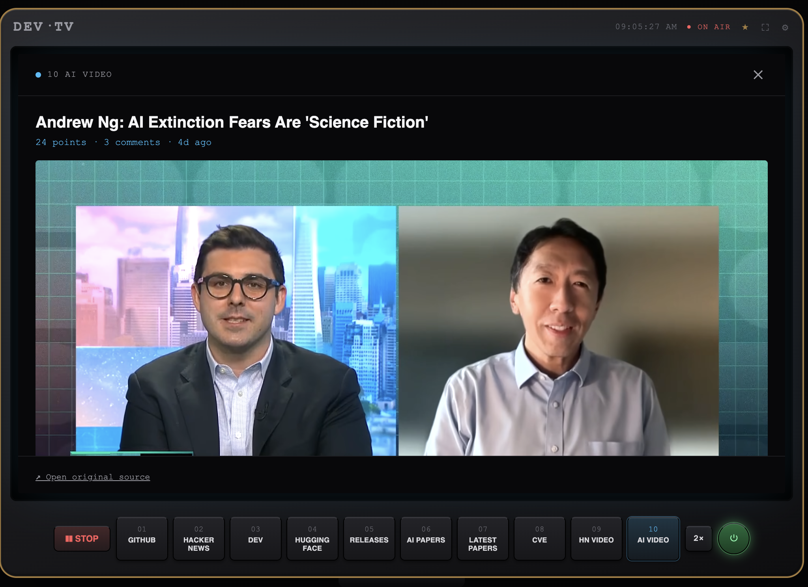
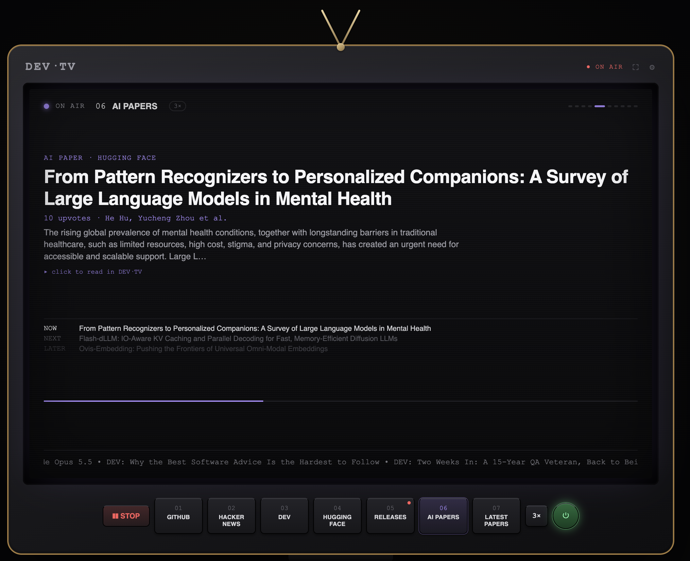
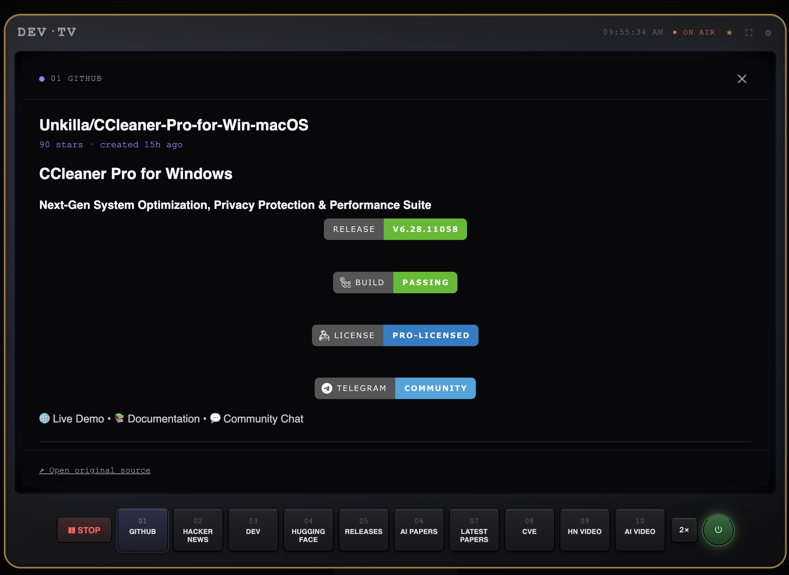
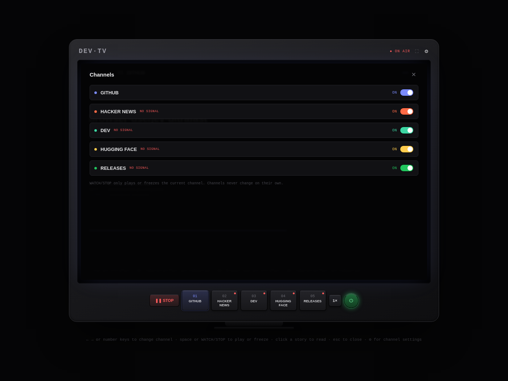
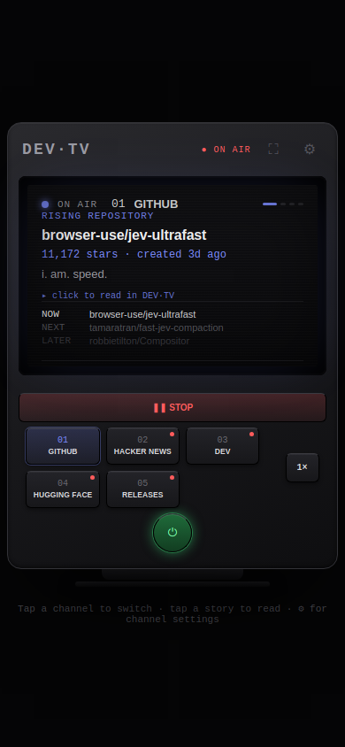

<div align="center">

# 📺 DEV·TV

### The developer internet, broadcast.

<a href="https://www.producthunt.com/products/dev-tv?embed=true&amp;utm_source=badge-featured&amp;utm_medium=badge&amp;utm_campaign=badge-dev-tv" target="_blank" rel="noopener noreferrer"></a>

[](./LICENSE)
[]()
[]()
[]()
[]()

Five tabs, checked out of habit, half-read, closed again. That's most people's relationship with GitHub, Hacker News, DEV.to, and Hugging Face. DEV·TV turns it into a TV instead: pick a channel, it plays.

**Keep coding. Keep an eye on the developer world.**

**[▶ Live demo](https://shouvik12.github.io/devtv/)** · **[View source](https://github.com/shouvik12/devtv)** · **[Product Hunt](https://www.producthunt.com/products/dev-tv?launch=dev-tv)**

</div>

---

### 🖼️ Screenshot





_Real capture: headless Chromium loaded `index.html`, tuned to the AI Papers channel, mid-broadcast. Every channel shows its source right in the small label above the headline, "AI PAPER · HUGGING FACE" here, since not every channel's name makes its underlying source as obvious as GitHub or Hugging Face's own model channel does._

---

## What it is

One HTML file. Nothing else. No build step, no server, no login screen, no cookie banner. Open it and it's already running, static crackling across the screen until the first channel locks in. Then it just plays: stories rotate on their own, NOW/NEXT/LATER ticking along above the headline, a ticker scrolling every channel's titles underneath, real per-pixel noise (`Math.random()` per pixel, not a repeating CSS texture) on every channel change, and a genuine CRT power-down when you're done, the screen actually squishes to a line, then a dot, then dark.

It is **not** a dashboard. A dashboard wants your full attention, wants you to digest everything and make a decision. DEV·TV wants the opposite: glance, catch one thing, get back to your editor. That's the entire bet the project is built on, not proven, just genuinely believed in enough to build.

## 📡 Channels

| # | Channel | Source | What it shows |
|---|---------|--------|----------------|
| 01 | **GitHub** | `api.github.com` | Repositories created in the last 2 days, sorted by stars. A "rising repository" heuristic, since GitHub's Trending page has no official API |
| 02 | **Hacker News** | `hacker-news.firebaseio.com` | Current front-page stories |
| 03 | **DEV** | `dev.to/api` | Today's top articles |
| 04 | **Hugging Face** | `huggingface.co/api` | Trending models, ranked by Hugging Face's own momentum score |
| 05 | **Releases** | `api.github.com` | Real version releases for the stacks people actually google to stay current: React, Vue, TypeScript, Node.js, Python, Rust |

### 📄 Papers (channels 06 and 07)

Two separate channels, both about research, built on two different philosophies:

| # | Channel | Source | What it shows |
|---|---------|--------|----------------|
| 06 | **AI Papers** | `huggingface.co/api` | Papers the Hugging Face community is discussing and upvoting *today*, a popularity filter |
| 07 | **Latest Papers** | `api.openalex.org` | Papers sorted strictly by publication date, no popularity filter at all |

- **AI Papers** shows what the AI research community is already excited about, someone has to have shared and upvoted it on Hugging Face first. That's a real signal of quality, but it means a paper from several days ago can still show up here if people are still discussing it.
- **Latest Papers** applies zero editorial judgment, it's whatever was published most recently, full stop, pulled from OpenAlex's much broader academic index rather than just what's shared on Hugging Face. A paper published an hour ago with nobody having looked at it yet can appear here.

Same tradeoff as the GitHub channel's own design: proven interest versus raw freshness. Neither is "better", they answer different questions.

### 🛡️ Security and video (channels 08 to 10)

| # | Channel | Source | What it shows |
|---|---------|--------|----------------|
| 08 | **CVE** | `services.nvd.nist.gov` | Vulnerabilities published in the last 7 days, with severity, from NIST's National Vulnerability Database |
| 09 | **HN Video** | `hn.algolia.com` | YouTube videos the Hacker News community upvoted in the last 2 weeks, sorted by points, playable right on the TV |
| 10 | **AI Video** | `hn.algolia.com` | The AI-focused slice of the same source: HN-upvoted YouTube videos from the last 30 days whose titles are about AI |

### 🎬 HN Video and AI Video (channels 09 and 10)

Conference talks, deep dives, and demos, chosen by Hacker News votes rather than a recommendation algorithm. The channel finds recent HN stories that link to YouTube (at least 10 points), skips channel and playlist links, removes duplicates, and plays the video inside the TV using YouTube's privacy-enhanced embed player (`youtube-nocookie.com`). No YouTube API key is involved: the player is a standard embed, not a data request. A link to the HN discussion sits under every video.

Things worth knowing:

- **In-TV playback needs the live site.** YouTube refuses to start its player on a page that has no web address to verify (you'd see "Error 153"). That happens when `index.html` is opened as a local file, including a copy opened from a phone's file manager. In that case the channel shows the video's thumbnail instead, and tapping it opens the video on YouTube. Open the [live demo](https://shouvik12.github.io/devtv/) and it plays on the TV, on desktop and on phones.
- **Phones may need one tap.** Mobile browsers block videos from starting with sound on their own.
- **Some uploaders disable embedding.** Those videos show YouTube's own error inside the player; "Open original source" still works.
- **Closing the reader stops the video.** The player is removed, not just hidden, so nothing keeps playing behind the TV.
- **iPhones play videos inside the TV** rather than jumping to full-screen.

**AI Video** uses the same source and the same player, but looks back 30 days instead of 14 and keeps only videos whose titles are clearly about AI: LLMs, GPT, Claude, Gemini, DeepSeek, diffusion, fine-tuning, agentic, and similar. Words that are too generic on their own, like "model" or "agent", are left out on purpose, so "Model trains at the museum" doesn't sneak in. The honest tradeoff of keyword matching: it misses AI videos with plain titles, and some weeks the channel is thinner than HN Video.

Every story links to its real source. Click a story and it opens in an in-app reader right on the TV, no new tab:

- **DEV.to**: the full article body
- **GitHub**: the repo's actual README
- **Hugging Face**: the model's README / model card
- **Releases**: the real release notes, already fetched, no extra request
- **AI Papers** / **Latest Papers**: the paper's abstract
- **CVE**: the full vulnerability description
- **HN Video** / **AI Video**: the video itself, playing on the TV (see above)
- **Hacker News**: full text for self-posts (Ask HN / Show HN). Most front-page stories link to an article on another website, which Hacker News doesn't host, so for those the reader opens with a clear banner ("This story links to an article on example.com") and a **Read the article ↗** link, followed by the top discussion comments, fetched live. If there's no discussion yet, you still get the banner and the link, never a dead end

Markdown from fetched content renders through a hand-rolled converter: everything is escaped first, then a narrow, explicitly whitelisted set of patterns (headers, bold, italic, code, tables, fenced code blocks, links, and images, including raw HTML ``/`<a>` tags, validated to http/https only) is turned back into real markup. Nothing fetched from an external source can inject real HTML into the page.



_Real capture of the reader opening a GitHub README. It happened to hit a live rate limit (`403`) from this repo's own testing volume when the screenshot was taken, which is actually a decent look at the app's real error handling: a clear message plus a working "Open original source" fallback, rather than a broken page._

## 🎛️ Controls

| Key / Button | Action |
|---|---|
| `←` `→`, `1`–`9`, or `0` | Change channel (`0` is channel 10). Doesn't interrupt playback either way |
| `❚❚ STOP` / `▶ WATCH` | Playing is the default, like turning on a real TV. STOP freezes on whatever story is currently showing; WATCH resumes from there |
| `⚙` | Toggle channels on/off. Each shows an explicit **ON** / **OFF** label, not just a switch position (at least one channel must stay on) |
| Speed button | `1×` `2×` `3×` `0.5×`, how long each story stays on screen |
| `⛶` | Fullscreen toggle |
| `★` | Opens this repo on GitHub in a new tab, where you can star it. The TV keeps playing |
| `⏻` | Power. Green glow means on, dim gray means off, tooltip tells you which way it'll flip. Powering off plays a real CRT-style collapse (screen squishes to a line, then a dot, then dark); powering on reverses it |
| `Esc` | Close the in-app reader |

Static (real per-pixel noise, not a CSS texture) plays continuously on first load until you pick a channel, and briefly on every channel change afterward, like actually tuning a signal.

A few more broadcast touches: a live clock sits in the header next to ON AIR (small phones drop the seconds so it fits), and every so often the TV cuts to a short fake commercial break for an invented developer product, like Works On My Machine™ Shipping, Merge Conflict Therapy, or Off-By-One Pizza. "This is not a real advertisement" is printed on every one. They're a rare treat, not a schedule: none in your first 3 minutes, then about one every 5 minutes of playback. Each lasts 6 seconds, changing the channel skips it, and **Commercial breaks** in the ⚙ panel switches them off entirely (the choice is remembered).



_The ⚙ panel: real ON/OFF labels per channel, plus live NO SIGNAL indicators for whichever channels this particular capture environment couldn't reach._

## 📱 Mobile

The layout is responsive below 640px: channel buttons resize to fit three per row, the WATCH/STOP button takes its own full-width row, round buttons grow to a 44px minimum touch target, and the footer hint swaps from keyboard shortcuts to tap instructions.



_Real capture at a 390×844 viewport, the same headless run as above._

## 🚀 Getting it running

This is one HTML file. No install, no dependencies, no account.

### On desktop (Chrome, Safari, Firefox, Edge, any browser)

1. **Download `index.html`**: on this repo's GitHub page, click the green **Code** button → **Download ZIP** (or just open [index.html](./index.html) and use the "Download raw file" button).
2. Find it in your Downloads folder.
3. **Open it**: double-click it, or drag it straight into an open browser window, or right-click it → **Open with** → your browser of choice.

```bash
open index.html        # macOS
start index.html        # Windows
xdg-open index.html     # Linux
```

That's it. It runs entirely in the browser, nothing to install.

### On mobile

Opening a local HTML file on a phone isn't really practical the way double-clicking it is on desktop, phones don't give you the same drag-and-drop file access. The easy path on mobile is to open a **hosted** version instead of a local file:

- If it's already deployed (see **Deploying it** below), just open that link in Chrome or Safari on your phone like any normal website.
- If it isn't deployed yet, **[Netlify Drop](https://app.netlify.com/drop)** takes about 10 seconds from a laptop and gives you a real URL you can then open on your phone.

The app itself is responsive and touch-friendly below 640px wide, so once it's loaded from a real URL, it works the same as on desktop. That includes HN Video: in-TV playback works on phones from the live site, but not from a downloaded copy of the file (see the HN Video section).

### ⚠️ Why it has to run as a real page, not inside a sandboxed preview

Every channel does a live `fetch()` to a third-party API from your browser. Some sandboxed environments (embedded previews, "artifact" runtimes) block outbound requests to arbitrary domains via content security policy. In that context every channel fails identically with a generic `Failed to fetch`, regardless of which API it's calling. Opening the file directly, or hosting it as a normal static page, removes that restriction. It behaves like any other webpage making a `fetch()` call.

## ☁️ Deploying it

It's a static file, so any static host works. No config needed.

- **[Netlify Drop](https://app.netlify.com/drop)**: drag `index.html` in. Live in seconds, no account required.
- **GitHub Pages**: push this repo, then enable Pages in **Settings → Pages**, pointing at the `main` branch root. `index.html` is already named correctly for this.
- **Cloudflare Pages / Vercel**: same drag-and-drop or CLI deploy flow.

## 🔧 Tech notes

- Vanilla HTML/CSS/JS. No framework, no build tooling, no npm packages.
- All state (enabled channels, playback speed) lives in `localStorage`, scoped per browser/origin.
- Each channel refreshes independently every 10 minutes, regardless of playback state. A channel that fails shows `SIGNAL LOST` with the underlying error, without affecting the others.
- The `RELEASES` channel makes 6 requests per refresh (one per tracked project) against `api.github.com`, same host as the `GITHUB` channel. Combined, the GitHub-backed channels use 7 requests per 10-minute refresh cycle, which is 42 requests/hour at the default rate. GitHub's unauthenticated core API allows 60 requests/hour/IP, so that leaves roughly 18/hour of headroom for interactive README reads before the shared limit is hit. To stretch that budget, each channel's stories are remembered in your browser for just under 10 minutes, so reloading the page doesn't spend requests again, and READMEs you've already opened are reused for an hour. If the limit is hit anyway, the channel keeps showing its last good stories with a note saying how old they are, and only shows an error if it has nothing saved at all. Note that this limit is tied to the originating IP, so multiple people behind the same public IP (an office, a shared network) share the same budget.
- `CVE` makes one request per refresh to NVD, well inside its keyless limit. `HN Video` and `AI Video` each make one request per refresh to HN's Algolia search API. None of these touch the GitHub budget above.
- The power-on/off transition is a real CSS keyframe animation (`scale` + `filter: brightness/contrast`) on the screen element, not a fade. It genuinely collapses to a line and a dot, CRT-style.

## 🚫 What's deliberately not here yet

Kept out of scope for the same reason a v1 TV network doesn't launch with 40 channels:

- User accounts, personalization, or a recommendation engine
- AI-generated summaries: every story is real source data, not a rewrite
- A backend of any kind (several candidate sources, Reddit, Product Hunt, X, LinkedIn, Discord, were evaluated and ruled out specifically because they require one; see below)
- Community-created channels
- Dozens of channels: ten is already a lot of TV

## 🔍 Sources considered and ruled out

For transparency, since this took real investigation to confirm:

| Source | Status |
|---|---|
| **Reddit** | Public JSON endpoints are being locked down; real OAuth exists but its token-exchange step has no CORS support (confirmed against `ssl.reddit.com/api/v1/access_token`). Would need a backend to hold the exchange server-side |
| **Product Hunt** | Even read-only API access requires exchanging a `client_id` plus a `client_secret` for a token. A secret can't live in public client-side code |
| **X / Twitter** | No free tier that can read data at all as of the 2026 pricing overhaul. Pay-per-request from the first call |
| **LinkedIn** | Real API access is partner-gated (manual approval, months-long, often rejected). No path for an individual developer |
| **Medium** | Official API discontinued. No path to credentials, free or paid |
| **Discord** | OAuth/bot-token required for everything; no global "trending" concept even with a token; CORS explicitly unsupported |
| **arXiv** | Tested live: API is real and keyless, but `export.arxiv.org` does not appear to support CORS for browser `fetch()`. Removed after confirming `Failed to fetch` while every other channel succeeded in the same session |
| **Semantic Scholar** | Tested live: blocked by CORS in the browser. Replaced by OpenAlex for the Latest Papers channel |
| **Lobsters** | Tested live: the public JSON API is real and used by many server-side tools, but it doesn't allow browser requests (`Failed to fetch`). Being usable from a server is not the same as being usable from a browser |
| **Noozra** (general news) | Tested live: `Failed to fetch`. The only mention of it anywhere online was a single directory listing marked "status unknown", so it may not exist as a working API at all |
| **YouTube Data API** | Needs an API key in public code, and its free daily quota is shared by every visitor (a single search costs 100 of 10,000 units). HN Video avoids it entirely by finding videos through Hacker News and using the standard embed player |

## 📄 License

MIT, see [LICENSE](./LICENSE).
